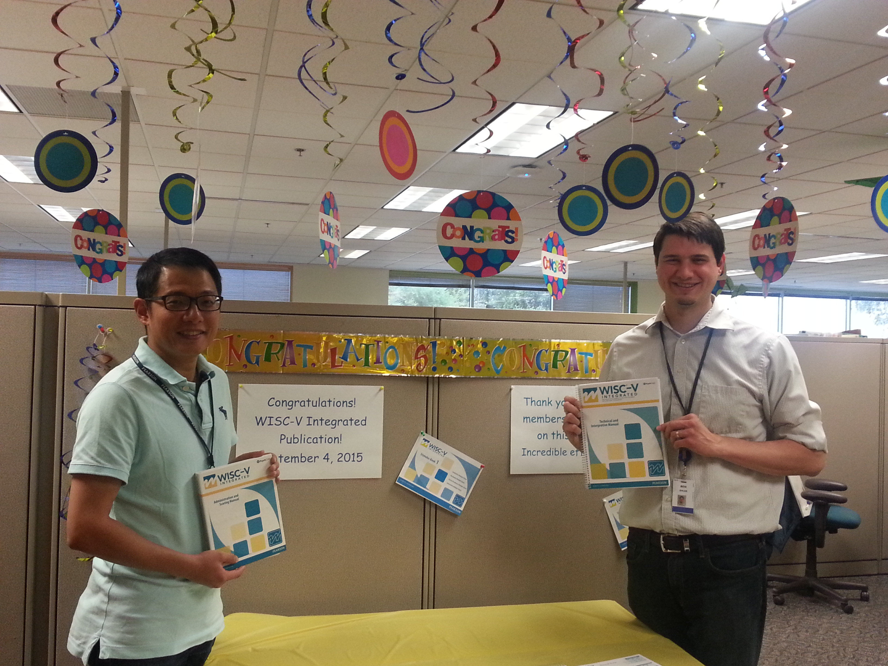
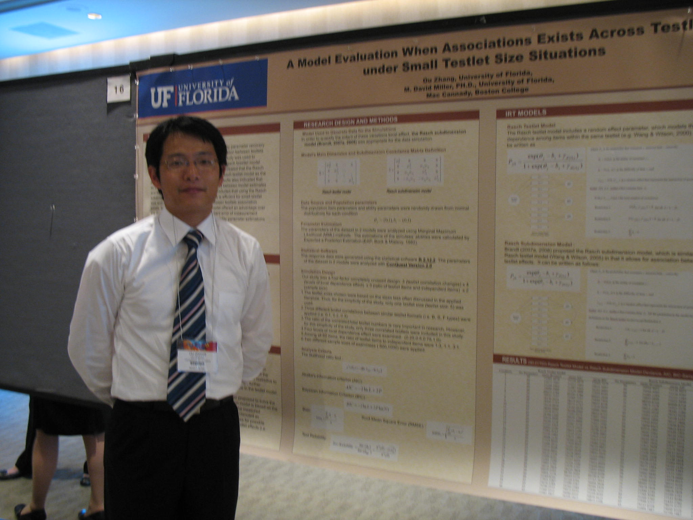
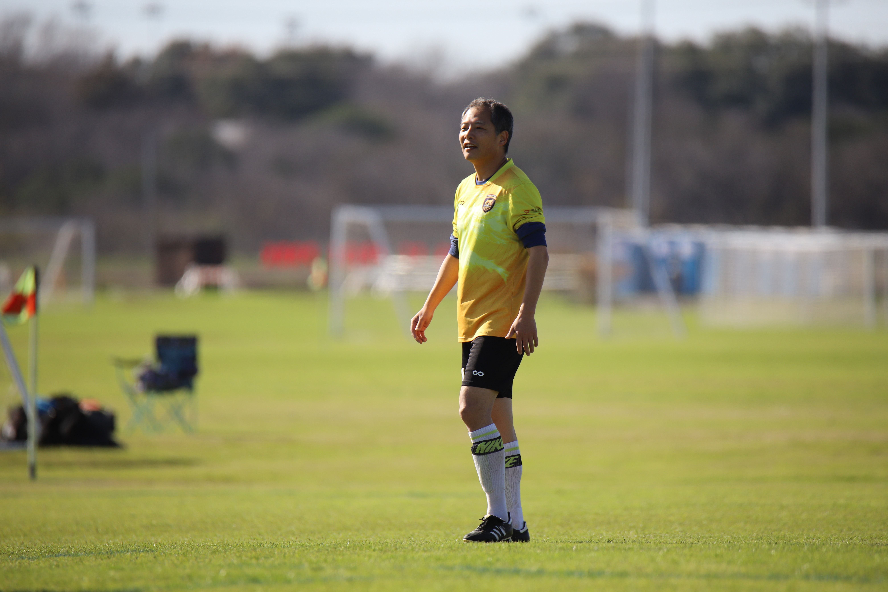

+++
# A Demo section created with the Blank widget.
# Any elements can be added in the body: https://sourcethemes.com/academic/docs/writing-markdown-latex/
# Add more sections by duplicating this file and customizing to your requirements.

widget = "blank"  # See https://sourcethemes.com/academic/docs/page-builder/
headless = true  # This file represents a page section.
active = true # Activate this widget? true/false
weight = 20  # Order that this section will appear.

title = ""
subtitle = ""

[design]
  # Choose how many columns the section has. Valid values: 1 or 2.
  columns = "1"

[design.background]
  # Apply a background color, gradient, or image.
  #   Uncomment (by removing `#`) an option to apply it.
  #   Choose a light or dark text color by setting `text_color_light`.
  #   Any HTML color name or Hex value is valid.

  # Background color.
  # color = "navy"
  
  # Background gradient.
  # gradient_start = "DeepSkyBlue"
  # gradient_end = "SkyBlue"
  
  # Background image.
  image = ""  # Name of image in `static/img/`.
  image_darken = 0.6  # Darken the image? Range 0-1 where 0 is transparent and 1 is opaque.

  # Text color (true=light or false=dark).
  text_color_light = false

[design.spacing]
  # Customize the section spacing. Order is top, right, bottom, left.
  padding = ["20px", "0", "20px", "0"]

[advanced]
 # Custom CSS. 
 css_style = ""
 
 # CSS class.
 css_class = "mini"
+++

I am originally from Chengdu, China and am a CDUTer from [Chendu University of Technology](https://www.cdut.edu.cn/). 

After college, I studied psychology, psychometrics, and quantitative methods, receiving my MEd. from [Boston College](https://www.bc.edu/) (2007), and Ph.D. from [University of Florida](https://www.uf.edu/) (2012). 

I am now a data scientist and psychometrician at [Pearson Psychometrics Service](https://www.pearson.com/). 
Prior to that, I was an psychometrician II and team lead at [Pearson Clinical Assessment](https://www.pearsonassessments.com/professional-assessments.html), and research fellow at [Assessment and Program Evaluation Services, University of Florida](https://education.ufl.edu/capes/).

	

My [research](https://www.github.com/zhangou888) mainly focuses on data science, psychometrics (i.e., MIRT, equating, norming), statistical modeling, and testing development.

I have written numerous scientific [publications](/publication) on psychometrics, test equating, norming and have presented my research at over 10 international conferences.

	

While at UF, I became an enthusiastic coder including R, Python, and SAS, both in the lab as a research fellow and in the classroom as a teaching assistant. 
I developed a passion for programming and data science, and during my tenure at Pearson I developed and gave talks on multiple 
[training seminars](/categories/talks/).

You can follow my current work for [My projects on GitHub](https://github.com/zhangou888). 

In my free time, I love watching and participating in all types of sports–football, basketball, baseball, soccer, swimming, etc. 

	. 

Thank you so much for reading.

