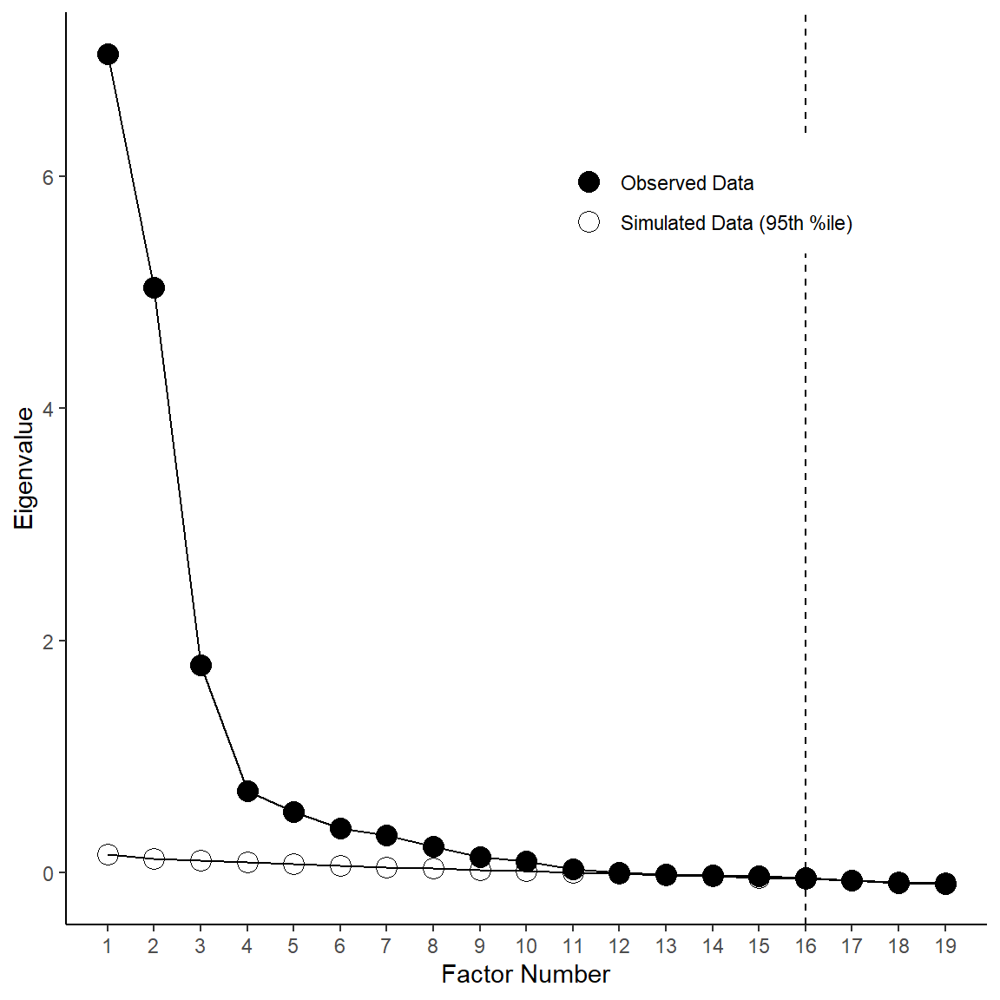

```{r set-global-options, echo = FALSE}
knitr::opts_chunk$set(eval = TRUE, 
                      echo = FALSE, 
                      cache = FALSE,
                      include = TRUE,
                      collapse = FALSE,
                      dependson = NULL,
                      engine = "R", # Chunks will always have R code, unless noted
                      error = TRUE,
                      # root.dir = "C:/Users/uzhanou/Documents/R/markdown/Serena/",
                      fig.path = "figure/",  # Set the figure options
                      fig.align = "center", 
                      fig.width = 6,
                      fig.height = 6)
```

```{r silent-packages, echo = FALSE, eval = TRUE, message=FALSE, include = FALSE}
## Step 2: load required packages 
packages <- c("paran","psych","GPArotation","tidyverse",
              "ggplot2","psychTools","MASS")
packages <- lapply(packages, FUN = function(x) {
  if (!require(x, character.only = TRUE)) {
    install.packages(x)
    library(x, character.only = TRUE)
  }  
})

```

Recently, a colleague of mine asked me to review a state assessment tech report for him. One section-"Parallel Analysis" caught my eyes.  

Although I have done many times parallel analysis in the past, it is always a good memory refreshing opportunity.  

Then, I just started searching materials online and create some source code in both `SAS` and `R`.  

So, before I start sharing materials, we need to know what is parallel analysis and how are we going to use it in our analysis. 

## WHAT IS PARALLEL ANALYSIS

When we operate factor analysis, the first decision that we will face in our factor analysis is the decision as to the number of factors that we will need to extract, in order to achieve the most parsimonious (but still interpretatable) factor structure.  

There are a number of methods that we could use, but the two most commonly employed methods are the **scree plot**, and **parallel analysis**.   

So here’s how parallel analysis helps you to decide how may factors to retain. You start with creating a scree plot, in which you plot the eigenvalues (variance explained), in descending order, of each factor you could conceivably extract. The scree plot is so-named because of the scree test proposed by Cattell (1966), who suggested you could look at where the “scree”–a term for rubble at the base of a hill–begins, in order to determine how many factors are necessary to retain.

Sometimes this scree test is a legitimately helpful tool for making factor retention decision, but this is most often in cases when scree plots are painfully obvious as to where there is a huge drop and levelling-off of eigenvalues. And as we shall soon see, there are often cases where the beginning of the “scree” is not so easy to identify in a scree plot. In those cases, the scree test is highly subjective at best, and simply uninformative at worst.

Parallel analysis (introduced by Horn, 1965) is a technique designed to help take some of the subjectivity out of interpreting the scree plot. It is a simulation-based method, and the logic is pretty straightforward:

## METHODOLOGY
Let `N` represent the number of observations in the dataset, and `p` represent the number of variables. In general, parallel analysis is completed as follows:  

1. Calculate the `p x p` sample correlation matrix from the `N x p` sample dataset. Create a scree plot by plotting the eigenvalues of the sample correlation matrix against their position from largest to smallest (`1, 2,…,p`) and connecting the points with straight lines

2. Generate a simulated dataset with N observations randomly sampled from `p` independent normal variates. Calculate the `p x p` correlation matrix for this simulated data and extract the p eigenvalues and order them from largest (position `1`) to smallest (position `p`).

3. Repeat step 2, `k` times (e.g., `k = 1000`).

4. Calculate the median of the of the k eigenvalues at position 1 from steps 2-3, the median of the `k` largest `eigenvalues` at position `2`, …, up to the median of the `k` eigenvalues at position `p`.

5. Overlay these medians from step 4 on the scree plot created in step 1, connecting the points.

6. The intersection of the two lines is the cutoff for determining the number of dimensions present in the data.

_Note: other summary statistics can be used in place of the median at step 4 (e.g., 99th percentile, 95th percentile, etc.)._

## PARALLEL ANALYSIS IN SAS

In a few minutes, I've found a very useful resource online. Kabacoff (2003) published a paper in SAS conference-"Determining the dimensionality of Data: A SAS Macro for Parallel Analysis". This paper mainly introduce a macro that you can use it to operate parallel analysis. 

You can find his paper [here](https://github.com/zhangou888/parallel_analysis/blob/master/sas/%5Bsas%5Ddetermine_the_dimensionality_of_data_macro_for_parallel_analysis.pdf)

I've also reformatted and modified his macro code and it can be download via this [link](https://github.com/zhangou888/parallel_analysis/blob/master/sas/parallel_analysis_macro.sas).


## PARALLEL ANALYSIS IN R

Various R-packages include functions that can conduct parallel analysis. Among all of them, 2 packages are worthwhile to be introduced- `paran`(Alexis Dinno, 2015), and `psych` (William Revelle, 2017).

You can find some parallel analysis R code example below.

### paran package example

The key option in the `paran` function is its centile option. 
By default, the centile option is set as $50%$. However, the traditional centile is usually set as $95%$ or $99%$.

```{r paran, echo = TRUE, eval = TRUE, message=FALSE, include = TRUE}

library(paran)
# -----  Example 1: package - paran --- #
data("USArrests")

## perform a standard parallel analysis on the US Arrest data 
# using 50% percentile.
paran(USArrests, iterations=5000)

## a conservative analysis with different result (95% and 99%)
paran(USArrests, iterations=5000, centile=95)

```

### psych package example

The 2nd parallel analysis example is from a factor anlaysis tutorial document by Rachael Smyth and Andrew Johnson. 

You can find this document [here](https://github.com/zhangou888/parallel_analysis/blob/master/R/%5BR_Tutorial%5D_FactorAnalysis.pdf).

```{r psych1, echo = TRUE, eval = TRUE, message=FALSE, include = TRUE, fig.show='hide'}
library(psych)
data("bfi")

# Describe data
describe(bfi[1:25])
sum(complete.cases(bfi[1:25]))

# Bartlett's Test of Sphericity
# The most liberal test is Bartlett's test of sphericity - 
# this evaluates whether or not the variables intercorrelate
# at all, by evaluating the observed correlation matrix against an "identity matrix"
# If this test is not statistically significant, you should not
# employ a factor analysis.
cortest.bartlett(bfi[1:25])

# Bartlett's test was statistically significant, suggesting that 
# the observed correlation matrix among the items is
# not an identity matrix.

# --- Determining the Number of Factors to Extract --- #

# Test 1: Scree Plot
bfi[,1:25] %>% scree()
```

```{r psych2, echo = TRUE, eval = TRUE, message=FALSE, include = TRUE, fig.show='hide'}
# Test 2: Parallel Analysis
bfi[,1:25] %>% fa.parallel()
```


I also found that a web post by Sakaluk & Short (2016) provides a very good R code example using `psych` and `ggplot` to do the parallel analysis.

(Sakaluk, J. K., & Short, S. D. (2016). A Methodological Review of Exploratory Factor Analysis in Sexuality Research: Used Practices, Best Practices, and Data Analysis Resources. Journal of Sex Research.)

You can find the web post [here](https://sakaluk.wordpress.com/2016/05/26/11-make-it-pretty-scree-plots-and-parallel-analysis-using-psych-and-ggplot2/#parallel).

```{r psych3, echo = TRUE, eval = TRUE, message=FALSE, include = TRUE, fig.show='hide'}

library(psych)
library(ggplot2)

# STEP 1: Read-in data
dat <- msq
keys <- make.keys(msq[1:75], list(
  EA = c(
    "active", "energetic", "vigorous", "wakeful", "wide.awake", "full.of.pep",
    "lively", "-sleepy", "-tired", "-drowsy"
  ),
  TA = c(
    "intense", "jittery", "fearful", "tense", "clutched.up", "-quiet", "-still",
    "-placid", "-calm", "-at.rest"
  ),
  PA = c(
    "active", "excited", "strong", "inspired", "determined", "attentive",
    "interested", "enthusiastic", "proud", "alert"
  ),
  NAf = c(
    "jittery", "nervous", "scared", "afraid", "guilty", "ashamed", "distressed",
    "upset", "hostile", "irritable"
  ),
  HAct = c("active", "aroused", "surprised", "intense", "astonished"),
  aPA = c("elated", "excited", "enthusiastic", "lively"),
  uNA = c("calm", "serene", "relaxed", "at.rest", "content", "at.ease"),
  pa = c("happy", "warmhearted", "pleased", "cheerful", "delighted"),
  LAct = c("quiet", "inactive", "idle", "still", "tranquil"),
  uPA = c("dull", "bored", "sluggish", "tired", "drowsy"),
  naf = c("sad", "blue", "unhappy", "gloomy", "grouchy"),
  aNA = c("jittery", "anxious", "nervous", "fearful", "distressed"),
  Fear = c("afraid", "scared", "nervous", "jittery"),
  Hostility = c("angry", "hostile", "irritable", "scornful"),
  Guilt = c("guilty", "ashamed"),
  Sadness = c("sad", "blue", "lonely", "alone"),
  Joviality = c("happy", "delighted", "cheerful", "excited", "enthusiastic", "lively", "energetic"), Self.Assurance = c("proud", "strong", "confident", "-fearful"),
  Attentiveness = c("alert", "determined", "attentive")
  # acquiscence = c('sleepy' , 'wakeful' , 'relaxed','tense')
))

# obtain efa data
msq.scores = scoreItems(keys,msq[1:75])
efa.data = msq.scores$scores

set.seed(123)
parallel = fa.parallel(efa.data,      # specify our data frame;
                       fm = 'ml',     # indicate that we want to estimate eigenvalues using maximum likelihood 
                       fa = 'fa',     # indicate that we only want the CF eigenvalues 
                       n.iter = 50,   # indicate that 50 times simulation for our parallel analysis;
                       SMC = TRUE,    # indicate that we want to use squared multiple correlations (SMCs)
                       quant = .95)   # specify that we would like the 95th quantile

```


```{r psych4, echo = TRUE, eval = TRUE, message=FALSE, include = TRUE, fig.show='hide'}

# ---  Making a Pretty Scree Plot with Parallel Analysis Using ggplot2 --- # 
# STEP 1: Create data frame from observed eigenvalue data
obs <- data.frame(parallel$fa.values)
obs$type <- c('Observed Data')
obs$num <- c(row.names(obs))
obs$num <- as.numeric(obs$num)
colnames(obs) <- c('eigenvalue', 'type', 'num')

# STEP 2: Calculate quantiles for eigenvalues, 
# but only store those from simulated CF model in percentile1
percentile <- apply(parallel$values, 2, function(x) quantile(x, .95))
min <- as.numeric(nrow(obs))
min <- (4 * min) - (min - 1)
max <- as.numeric(nrow(obs))
max <- 4 * max
percentile1 <- percentile[min:max]

# Create data frame called &amp;amp;amp;amp;amp;quot;sim&amp;amp;amp;amp;amp;quot; with simulated eigenvalue data
sim <- data.frame(percentile1)
sim$type <- c("Simulated Data (95th %ile)")
sim$num <- c(row.names(obs))
sim$num <- as.numeric(sim$num)
colnames(sim) <- c("eigenvalue", "type", "num")

# Merge the two data frames (obs and sim) together into data frame called eigendat
eigendat <- rbind(obs, sim)

# Apply ggplot2
apatheme <- theme_bw() +
  theme(
    panel.grid.major = element_blank(),
    panel.grid.minor = element_blank(),
    panel.background = element_blank(),
    panel.border = element_blank(),
    text = element_text(family = "Arial"),
    legend.title = element_blank(),
    legend.position = c(.7, .8),
    axis.line.x = element_line(color = "black"),
    axis.line.y = element_line(color = "black")
  )

# Use data from eigendat. Map number of factors to x-axis, eigenvalue to y-axis, and give different data point shapes depending on whether eigenvalue is observed or simulated
p <- ggplot(eigendat, aes(x = num, y = eigenvalue, shape = type)) +
  # Add lines connecting data points
  geom_line() +
  # Add the data points.
  geom_point(size = 4) +
  # Label the y-axis 'Eigenvalue'
  scale_y_continuous(name = "Eigenvalue") +
  # Label the x-axis 'Factor Number', and ensure that it ranges from 1-max # of factors, increasing by one with each 'tick' mark.
  scale_x_continuous(name = "Factor Number", breaks = min(eigendat$num):max(eigendat$num)) +
  # Manually specify the different shapes to use for actual and simulated data, in this case, white and black circles.
  scale_shape_manual(values = c(16, 1)) +
  # Add vertical line indicating parallel analysis suggested max # of factors to retain
  geom_vline(xintercept = parallel$nfact, linetype = "dashed") +
  # Apply our apa-formatting theme
  apatheme
# Call the plot. Looks pretty!
p

# Save a high-res version of your plot, 
# and you've got yourself a pretty scree plot with parallel analysis:
# ggsave('parallel.png', width=6, height=6, unit='in', dpi=300)
```


Finally, William Revelle's `psych` package tutorial document is helpful too.

You can find her paper [here](https://github.com/zhangou888/parallel_analysis/blob/master/R/%5BR_tutorial%5D_Use%20the%20psych%20package%20for%20Factor%20Analysis%20and%20data%20reduction.pdf).


